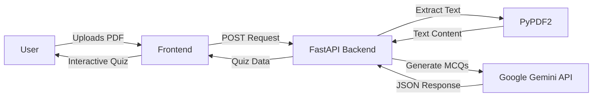

# ✨ MCQify: AI-Powered Quiz Generator

<div align="center">

**Transform any PDF into an interactive quiz in seconds** 🚀

[](https://mcqify.onrender.com)
[](https://fastapi.tiangolo.com/)
[](https://ai.google.dev/)
[](https://tailwindcss.com/)

[Live Demo](https://mcqify.onrender.com) • [Features](#-features) • [Getting Started](#-getting-started) • [API Docs](#-api-reference)

</div>

---

## 🎯 What is MCQify?

MCQify is an intelligent quiz generator that leverages the power of Google's Gemini AI to transform your documents into engaging multiple-choice quizzes. Whether you're a student preparing for exams, a teacher creating assessments, or a professional testing knowledge retention, MCQify makes quiz creation effortless and fun!

Simply upload a PDF, choose how many questions you want, and let AI do the magic ✨

---

## 🌟 Features

### 📄 Smart PDF Processing
- **Instant Upload**: Drag-and-drop or browse to upload any PDF document
- **Intelligent Extraction**: Advanced text processing to understand your content
- **Universal Compatibility**: Works with lecture notes, textbooks, articles, and more

### 🤖 AI-Powered Generation
- **Google Gemini Integration**: Utilizes cutting-edge AI for high-quality question generation
- **Customizable Length**: Choose exactly how many questions you need (5, 10, 20, or more!)
- **Contextual Questions**: AI understands your content to create relevant, challenging questions

### 🎮 Interactive Experience
- **Real-Time Feedback**: Instant visual feedback (green ✓ for correct, red ✗ for incorrect)
- **Answer Reveals**: See the correct answer immediately when you get one wrong
- **Progress Tracking**: Know exactly where you stand throughout the quiz
- **Final Score Summary**: Comprehensive results at the end

### 📊 Results & Sharing
- **Download Results**: Save your score and full quiz as a `.txt` file
- **Share Your Achievement**: Easy sharing options to show off your knowledge
- **Performance Analytics**: Track your progress over time

### 🎨 Beautiful UI
- **Modern Design**: Clean, playful interface built with Tailwind CSS
- **Fully Responsive**: Perfect on desktop, tablet, and mobile
- **Smooth Animations**: Delightful interactions that make learning fun
- **Dark Mode Ready**: Easy on the eyes during late-night study sessions

---

## 🛠️ Tech Stack

### Backend
```python
FastAPI      # High-performance API framework
Uvicorn      # Lightning-fast ASGI server
Gemini AI    # Google's powerful language model
PyPDF2       # Robust PDF text extraction
python-dotenv # Secure environment management
```

### Frontend
```javascript
HTML5        # Semantic markup
Tailwind CSS # Modern utility-first styling
Vanilla JS   # Fast, dependency-free interactivity
```

### Deployment
- **Backend**: Deployed on [Render](https://render.com) for reliable, scalable hosting
- **Frontend**: Can be hosted anywhere (Netlify, Vercel, GitHub Pages, etc.)

---

## 🏗️ Architecture



**Flow:**
1. User uploads PDF and selects question count
2. Frontend sends file to FastAPI backend via `fetch`
3. Backend extracts text using PyPDF2
4. Text is sent to Google Gemini with structured prompt
5. Gemini returns clean JSON with questions, options, and answers
6. Backend forwards JSON to frontend
7. Frontend dynamically builds interactive quiz

---

## 🚀 Getting Started

### Prerequisites
- Python 3.9 or higher
- Google Gemini API Key ([Get it here](https://ai.google.dev/))
- Git

### Installation

1. **Clone the repository**
```bash
git clone https://github.com/your-username/mcqify.git
cd mcqify
```

2. **Set up Python environment**
```bash
# Create virtual environment
python -m venv .venv

# Activate it
# Windows:
.\.venv\Scripts\Activate
# macOS/Linux:
source .venv/bin/activate
```

3. **Install dependencies**
```bash
pip install -r requirements.txt
```

Or install manually:
```bash
pip install fastapi "uvicorn[standard]" google-generativeai python-dotenv PyPDF2
```

4. **Configure environment variables**

Create a `.env` file in the root directory:
```env
GEMINI_API_KEY=your_secret_api_key_here
```

5. **Run the backend**
```bash
python -m uvicorn main:app --reload
```

Server will start at `http://127.0.0.1:8000` 🎉

6. **Launch the frontend**

Open `index.html` in your browser, or use a local server:
```bash
# Using Python
python -m http.server 8080

# Using Node.js
npx serve .
```

---

## 📖 API Reference

### Health Check
```http
GET /ping
```

**Response:**
```json
{
  "message": "pong"
}
```

---

### Generate MCQs
```http
POST /generate_mcq
```

**Request:**
- Content-Type: `multipart/form-data`
- Body:
  - `file`: PDF file (required)
  - `num_questions`: Integer (required, e.g., 5, 10, 20)

**Success Response (200):**
```json
{
  "mcqs": [
    {
      "question": "What is the capital of France?",
      "options": ["Berlin", "Madrid", "Paris", "Rome"],
      "correct_answer": "Paris"
    },
    {
      "question": "Which planet is known as the Red Planet?",
      "options": ["Venus", "Mars", "Jupiter", "Saturn"],
      "correct_answer": "Mars"
    }
  ]
}
```

**Error Responses:**
- `400 Bad Request`: Invalid file type or no text extracted
- `500 Internal Server Error`: AI generation failed

---

## 🎨 Customization

### Changing Question Count Options
Edit the frontend JavaScript to modify available options:
```javascript
const questionCounts = [5, 10, 15, 20, 25, 30];
```

### Styling
All styles use Tailwind CSS utility classes. Customize colors, spacing, and animations in `index.html`.

### AI Prompt Engineering
Modify the Gemini prompt in `main.py` to adjust question difficulty, format, or style.

---

## 🤝 Contributing

Contributions are welcome! Here's how you can help:

1. Fork the repository
2. Create your feature branch (`git checkout -b feature/AmazingFeature`)
3. Commit your changes (`git commit -m 'Add some AmazingFeature'`)
4. Push to the branch (`git push origin feature/AmazingFeature`)
5. Open a Pull Request

---

## 📝 License

This project is licensed under the MIT License - see the [LICENSE](LICENSE) file for details.

---

## 🙏 Acknowledgments

- **Google Gemini** for providing powerful AI capabilities
- **FastAPI** for the excellent web framework
- **Tailwind CSS** for beautiful, responsive design
- **Render** for reliable hosting

---

## 📬 Contact

Have questions or suggestions? Feel free to reach out!

- **GitHub**: [@your-username](https://github.com/your-username)
- **Email**: your.email@example.com
- **Twitter**: [@your-handle](https://twitter.com/your-handle)

---

<div align="center">

**Made with ❤️ and ☕**

If you found this project helpful, please consider giving it a ⭐!

[⬆ Back to Top](#-mcqify-ai-powered-quiz-generator)

</div>
